AM接收机及包络检波器设计

# 1 超外差式AM接收机设计及仿真验证

## 1.1 AM超外差式接收机结构框图

超外差式接收机结构框图如图1-1所示。

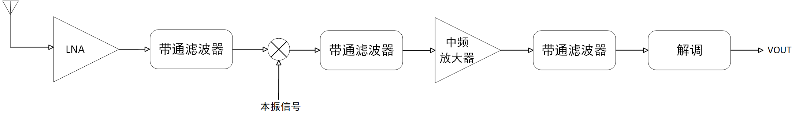

图 1-1 超外差式接收机结构框图

## 1.2 AM超外差式接收机数学描述分析

题意要求接收机待接收的信号为：频点在1MHz，信道带宽为8kHz，调制指数为0.8的AM信号。

假定天线接收到的载波信号振幅为10mV，调制信号频率$$F = \frac{B W}{2} = 4 k H z$$，则AM调幅波的表达式为：

$$
V ( t ) = V_{c m} \left( 1 + m_{a} c o s \Omega t \right) \cos \omega_{c} t= 1 0 ( 1 + 0 . 8 c o s 2 \pi * 4 0 0 0 t ) c o s 2 \pi * 10^{6} t ( m V )
$$

下混频器将接收到的射频信号搬移到465kHz的中频频点，本振信号的表达式为：

$$
V_{L O} ( t ) = V_{L O} c o s \omega_{L O} t
$$

则本振信号频率为

$$
\omega_{L O} = 10^{6} - 4 6 5 * 10^{3} = 5 3 5 k H z
$$

下混频器输出电压表达式为：

$$
V_{1} ( t ) = V_{c m} ( 1 + m_{a} c o s \Omega t ) \cos \omega_{C} t \times V_{L O} \cos  \omega_{L O} t
$$

计算得到，下混频器输出包含的频谱分量为

$$
\omega_{c} \pm \omega_{L O} + \Omega 、 \omega_{c} \pm \omega_{L O} - \Omega
$$

经过带通滤波器滤出$$\omega_{c} - \omega_{L O} \pm \Omega$$，即为中频频点处的信号。

## 1.3 仿真设计与验证

假设本振信号振幅为100mV，模拟乘法器输出增益为10V/V。

中频频点处有源带通滤波器设计如图1-2所示，使用FilterPro进行设计，中心频率为465kHz，增益为10dB，带宽为8000Hz，滤波器阶数为二阶，反馈类型为巴特沃兹型，拓扑结构为Sallen-Key类型。

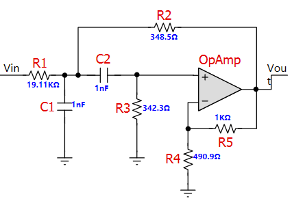

图 1-2 中频带通滤波器设计

题意要求输出信号的载波振幅不低于500mV，因此，使用同相比例放大器对中频信号进行线性放大，由此得到电路原理图如图1-3所示。

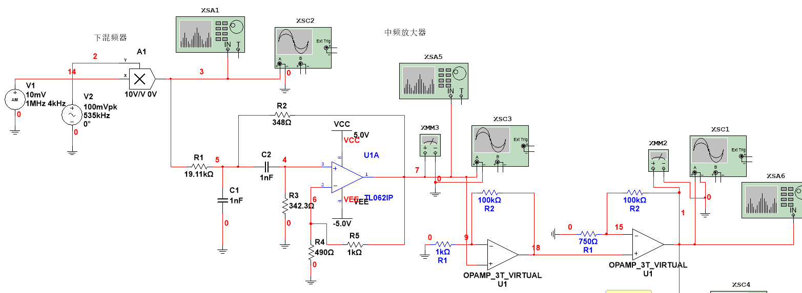

图 1-3 下混频器及中频放大器设计

得到中频输出电压波形图及载波振幅数值如图1-4所示，载波振幅不低于500mV，符合题意要求。

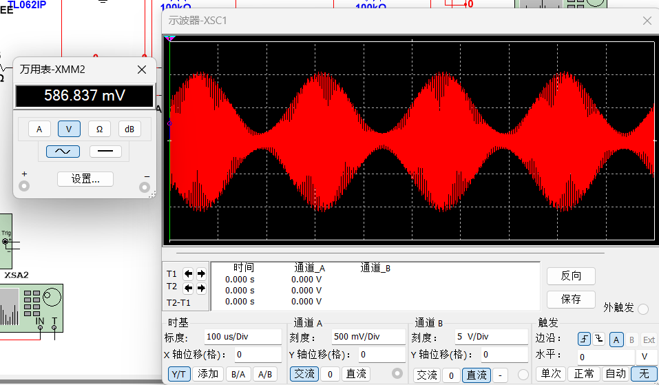

图 1-4 中频输出电压波形图

对中频放大器输出信号的频谱进行分析，结果如图1-5所示，其中中频频点约为465kHz，旁频约为461.1kHz与469.1kHz，带宽约为8kHz与理论计算值相符。

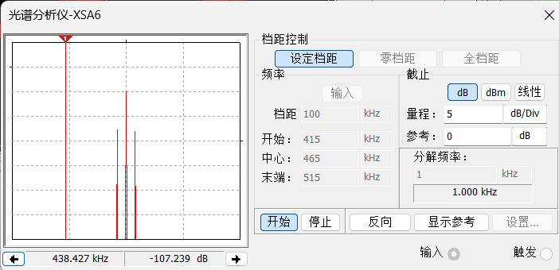

图 1-5 中频放大器输出信号频谱分析

AM解调器采用相干解调，使用模拟乘法器将中频信号与中频同频同相的参考信号$$v_{r} ( t )$$相乘后经过低通滤波器滤除高频$$2 \omega_{c} \pm \Omega$$得到调制信号。

低通滤波器设计采用$$\pi$$型巴特沃兹无源低通滤波器，滤波器阶数为4，解调器负载为50$$\Omega$$，使用在线软件进行低通滤波器设计，得到参数如图1-6 所示。

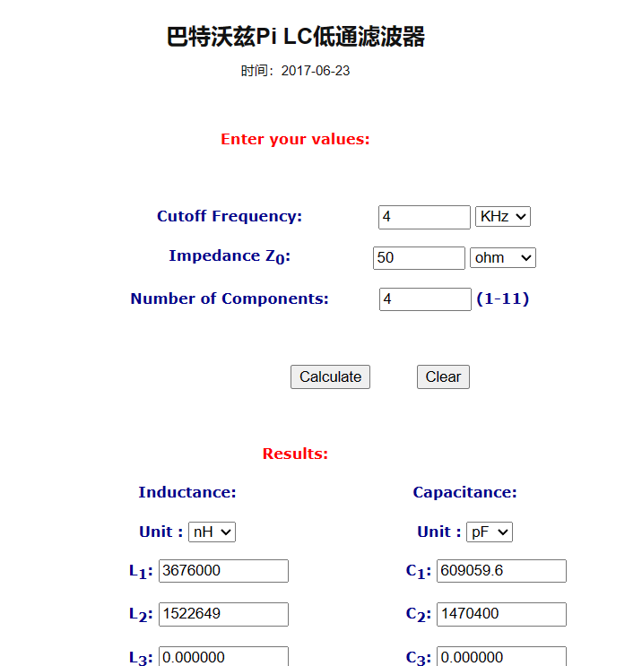

图 1-6 相干解调低通滤波器设计

相干解调电路原理图如图1-6所示。

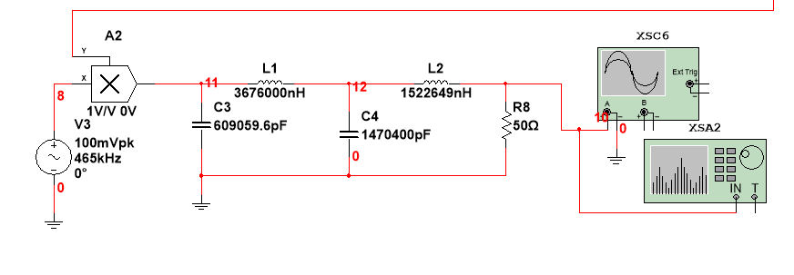

图 1-6 相干解调电路原理图

解调器恢复的调制信号输出波形如图1-7所示，信号周期约为250us，频率约为4kHz，说明AM调制器能够恢复出调制信号符合题目要求。

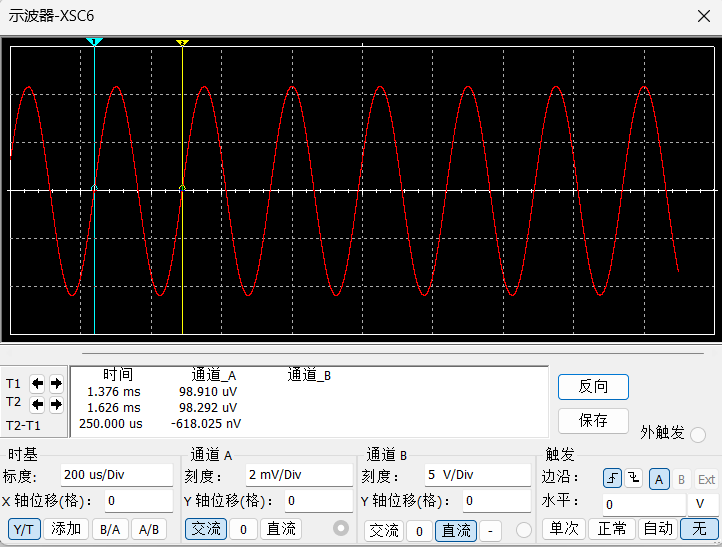

图 1-7 AM解调器输出波形

# 2 包络检波器电路原理的AM信号解调器设计

包络检波需要二极管在低信号电平下工作，选择正向电压降较低的二极管（如锗二极管或肖特基二极管）比较合适。

锗二极管的正向电压降一般在0.2-0.3V之间，而肖特基二极管的正向电压降一般在0.1-0.4V之间。在高频应用中，二极管的反向恢复时间越短越好，因为较短的反向恢复时间可以减少信号失真，保持信号的完整性。肖特基二极管通常具有非常短的反向恢复时间。

因此，选择BAT54肖特基二极管进行包络检波，其具有低正向压降和非常快速的开关动作。

包络检波电路原理图如图2-1所示。

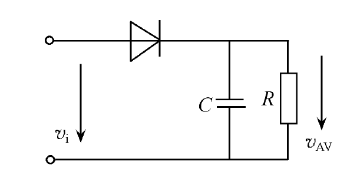

图 2-1 包络检波电路原理图

对于载频为$$f_{c} = 4 6 5 k H z$$($$\frac{1}{\omega_{c}} = \frac{1}{2 \pi f_{c}} = 0 . 3 5 \mu s$$)，调制信号频率$$F = 4 k H z$$($$\frac{1}{\Omega_{\max}} = 3 9 . 8 \mu s$$)的AM信号，可令$$R C = 2 0 \mu s$$($$\frac{10}{\omega_{c}} < R C < \frac{1}{\Omega_{\max}}$$)，如取$$C = 0 . 0 1 \mu F$$，则$$R = 2 k \Omega$$，均为标称值。

得到电路图如图2-2所示。

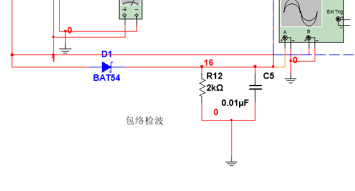

图 2-2 包络检波电路

包络检波输出波形与中频放大的AM信号对比图如图2-3所示，包络检波输出波形周期约为4kHz，波形与AM信号包络相符，能够有效解调AM信号。

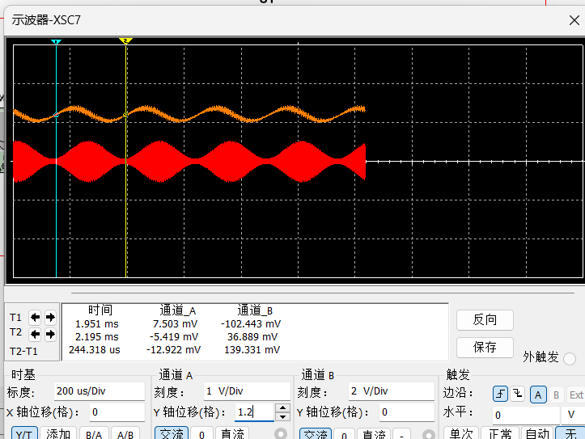

图 2-3 AM信号包络检波解调

## 2.1 包络检波器的参数设计

为了避免惰性失真和负峰切割失真，低通滤波器RC需满足的条件为：

1.  滤除高频，即时间常数
$$
R C \gg \frac{1}{\omega_{c}}
$$
2.  通过低频，即时间常数
$$
R C < \frac{1}{\Omega_{\max}}
$$
3.  不产生惰性失真，即时间常数

$$
RC\leq\frac{\sqrt{1-m_a^2}}{m_a\Omega_{max}}
$$

4.  不产生负峰切割失真，即
$$
m_{a} \frac{R_{=}}{R_{\sim}} < 1
$$

## 2.2 惰性失真

惰性失真是由于放电时间常数RC太大，使电容器上的电压变化跟不上信号包络的下降速度所致。惰性失真理论波形图如图2-4所示。

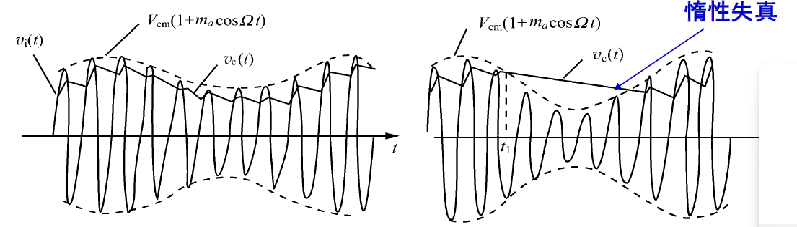

图 2-4 惰性失真理论波形

于是，不产生惰性失真的条件为，时间常数$$R C \leq \frac{\sqrt{1 - m_{a}^{2}}}{{m_{a} \Omega}_{\max}} = \frac{\sqrt{1 - {0 . 8}^{2}}}{0 . 8 * 2 \pi * 4 k} = 2 9 . 8 4 \mu s$$。当取$$R = 2 k \Omega$$，$$C = 3 3 n F$$时，$$R C = 6 6 \mu s > 2 9 . 8 4 \mu s$$，产生了明显的惰性失真，与理论计算相符。

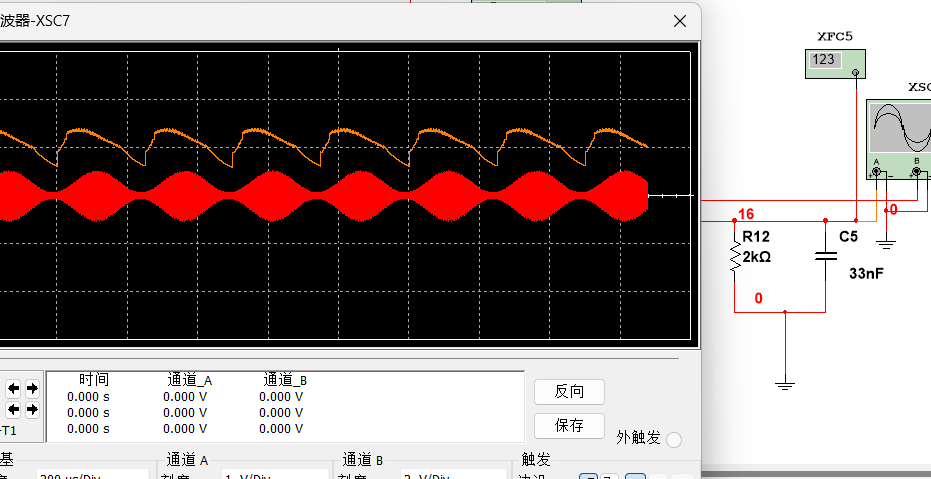

图 2-5 包络检波惰性失真

因此，避免惰性失真，在输入信号的幅度下降的任何时刻都应满足电容器通过R的放电速度大于或等于包络的下降速度，即放电时间常数RC应满足：

$$
R C \gg \frac{1}{\omega_{c}}R C \leq \frac{\sqrt{1 - m_{a}^{2}}}{{m_{a} \Omega}_{\max}}
$$

## 2.3 负峰切割失真

对于负峰切割失真，在接收机中，检波器后接音频放大器，为了不影响音频放大器的直流工作状态，检波器与下级间采用加隔直流电容的交流耦合方式，如图2-6所示，其中$$R_{L}$$为下级的输入阻抗，$$C_{g}$$应对所有音频调制信号短路。

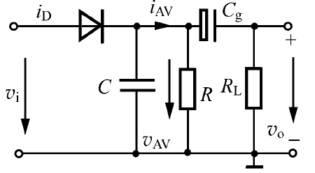 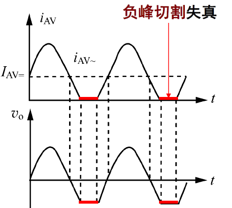

图 2-6 负峰切割失真

在上述电路中，检波器的直流负载为$$R_{=} = R$$，交流负载为$$R_{\sim} = R / / R_{L}$$。由于交、直流负载不同，有可能产生负峰切割失真。

于是，为了避免负峰切割失真，应满足：

$$
m_{a} \frac{R_{=}}{R_{\sim}} < 1
$$

若取$$R_{=} = R = 2 k \Omega$$，则$$R_{\sim} > m_{a} R_{=} = 0 . 8 * 2 0 0 0 = 1 6 0 0 \Omega$$。取$$R_{L} = 2 k \Omega$$，则$$R_{\sim} = 1 k \Omega < 1 6 0 0 \Omega$$，理论上应产生负峰切割失真。实际仿真波形图如图2-7所示，产生了负峰切割失真，与AM信号包络有一定差异。

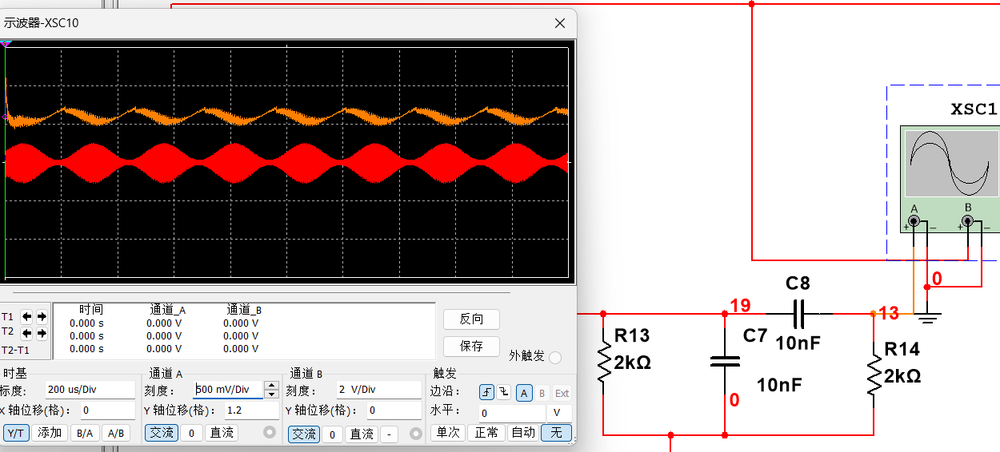

图 2- 7 负峰切割失真仿真波形图

取$$R_{L} = 1 0 k \Omega$$，则$$R_{\sim} = 1 . 6 7 k \Omega > 1 6 0 0 \Omega$$，理论上将避免负峰切割失真的产生。实际仿真波形图如图2-8所示，负峰切割现象有所缓解，与理论计算相符。

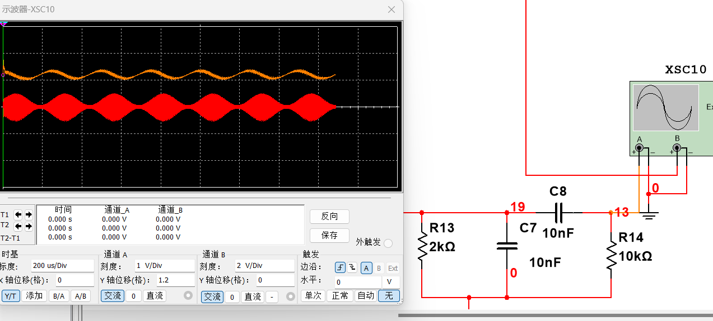

图 2-8 避免负峰切割失真波形图