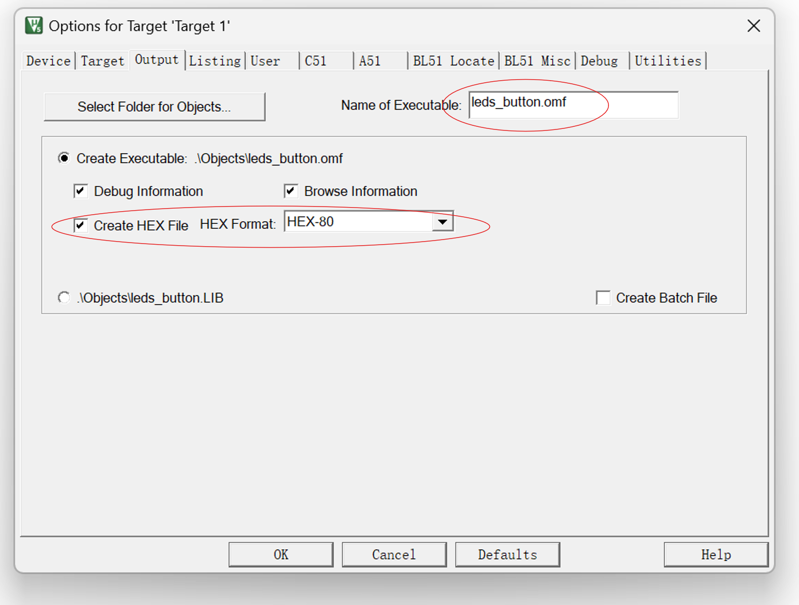
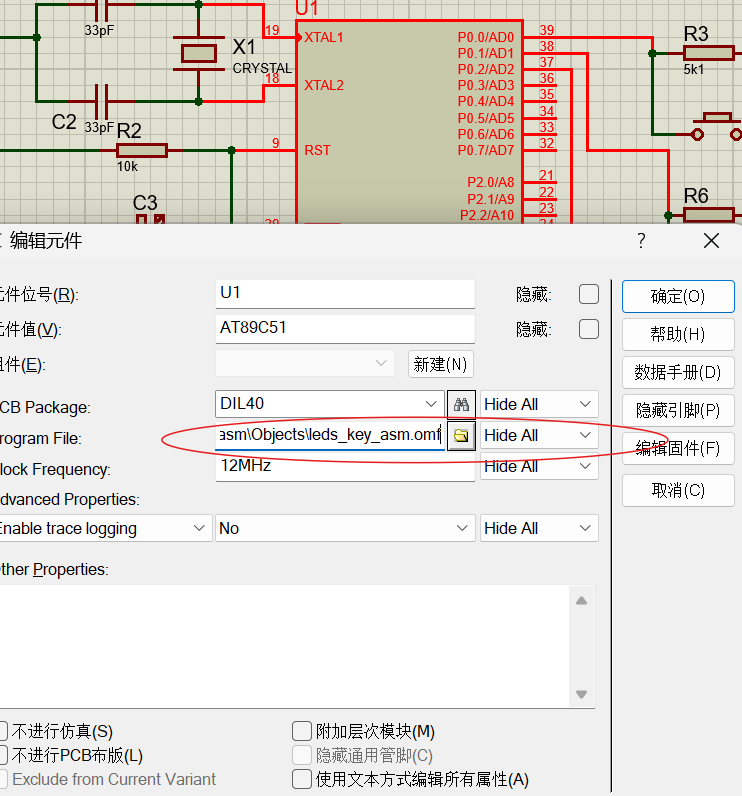
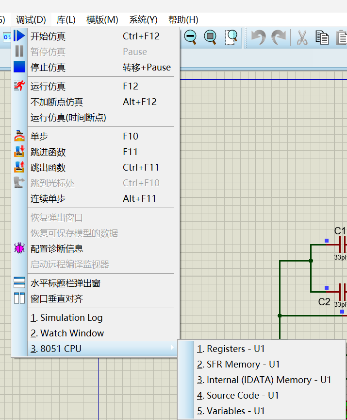
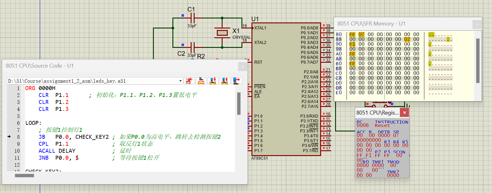

Proteus8 汇编源码/C源码直接调试

# Proteus8 汇编源码/C源码直接调试

Proteus自带的调试器可以实现对Keil编译生成的.omf文件进行单步调试和仿真。更改Keil输出文件选项，用keil编译的汇编文件或C语言文件在Proteus实现源码仿真，在Keil编译时生成`.omf`文件取代`.hex`文件，将其加载给微控制器，就可以实现Proteus下的源码仿真，而不需要同时打开Keil。

不同的编译器产生的`.omf`文件格式不尽相同。因此，并不是所有的`.omf`文件在Proteus中都支持源代码调试。

点击魔法棒，在options for Target的Output中，将Name of Executable的文件后缀改为`.omf`各式（`.omf51`格式文件是Keil中生成的带调试信息的目标文件），如下图所示：

在Proteus中，导入Keil编译生成的`.hex`文件或`.omf`文件，在Objects目录下。

（`.hex`文件可以仿真实验现象，但不能在Proteus中进行单步调试，需要配合Keil进行联合仿真才能实现单步调试；`.omf`文件可在Proteus中直接实现单步调试）

图中展示了代码、特殊功能寄存器表等窗口：

得到仿真界面如下图所示：

