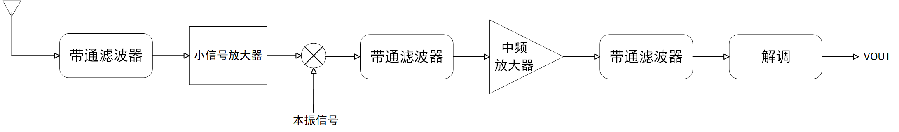

FM接收机及正交鉴频器设计，模拟乘法器使用AD834

# 1 单信道超外差式FM接收机设计及仿真验证

## 1.1 FM超外差式接收机结构框图

FM超外差式接收机结构框图如图2-1所示：

图 2-1 FM超外差式接收机结构框图

## 1.2 FM超外差式接收机数学描述分析

FM调频波的表达式为：

$$
v ( t ) = V_{c m} \cos \left( \omega_{c} t + m_{f} \sin \Omega t \right)
$$

其中，$$m_{f} = \frac{\Delta \omega_{m}}{\Omega} = \frac{\Delta f_{m}}{F}$$，F为调制信号频率，$$\Delta f_{m}$$为最大频偏。

题意要求接收机收到的已调信号为：工作频点$$\omega_{c} = 3 0 M H z$$，最大频偏$$\Delta f_{m} = 15 k H z$$，调制指数为$$m_{f} = 3$$，最大振幅为$$V_{c m} = 1 0 0 \mu V$$的调频信号。

于是，调制信号的频率为5kHz，调频波的带宽为：

$$
B W_{C R} = 2 \left( \Delta f_{m} + F \right) = 2 \times ( 1 5 k H z + 5 k H z ) = 4 0 k H z
$$

下混频器可以将已调信号搬移至10.7MHz 的中频频点。混频器的本振信号表达式为：

$$
V_{L O} ( t ) = V_{L O} c o s \omega_{L O} t
$$

则本振信号频率为：

$$
\omega_{L O} = 3 0 M H z - 1 0 . 7 M H z = 1 9 . 3 M H z
$$

下混频器输出电压表达式为：

$$
V_{1} ( t ) = V_{c m} \cos \left( \omega_{c} t + m_{f} \sin \Omega t \right) \times V_{L O} \cos  \omega_{L O} t
$$

于是，下混频器输出电压包含的频率分量主要集中在10.7MHz与49.3MHz的频点处。因此使用带通滤波器滤出10.7MHz频点处的中频信号即可。

## 1.3 仿真设计与验证

中频信号的滤波器采用最大平坦带通滤波器进行设计，原理图如图2-2所示。

图 2-2最大平坦带通滤波器原理图

使用在线软件进行设计，滤波器阶数设为4阶，中心频率为10.7MHz，带宽为1MHz，输出阻抗为50$$\Omega$$。

图 2-3最大平坦带通滤波器设计

下混频器使用Multisim虚拟模拟乘法器实现，增益为1V/V，得到下混频器及中频带通滤波器电路图如图2-4所示。

图2-4下混频器及中频滤波器电路原理图

由于题目要求，解调器输入的中频信号振幅至少为100mV，而FM输入信号振幅仅为100$$\mu V$$，因此在带通滤波器后级接入五级同相比例放大器，对中频信号进行线性放大。

图2-5 中频放大器设计

测量中频输出电压波形、振幅、频点及带宽。

输出波形图如图2-6所示，符合FM调频信号的特征。

图 2-6中频点输出波形图

输出电压有效值约为186mV大于100mV，符合题意要求，且输出电压频率为10.7MHz，在中频频点处。

图 2-7输出电压探针数据测量

使用频率计数器对中频输出电压频率进行测量，得到频率摆动范围为$$1 0 . 6 8 5 M H z \sim 1 0 . 7 1 5 M H z$$，符合$$\Delta f_{m} = 1 5 k H z$$的最大频偏理论值。

 

图 2-8 输出电压频偏测量

使用频谱分析仪测量中频输出信号的频谱，带宽约为41kHz，与理论计算值近似。

图 2-9输出电压频谱测量

# 2 正交鉴频器设计

## 2.1 移相网络设计

FM接收机的解调器部分由正交鉴频器构成，正交鉴频器由频相转换网络与乘积型鉴相器组成，将输入调频波的频率变化转换为输出信号的一个附加相移，并用鉴相器转换为输出信号电压的变化，其原理图如图2-10所示。

图 2-10正交鉴频器原理图

对于移相网络的参数估算，根据

$$
\Delta \varphi = - a r c t g \xi = - a r c t g 2 Q_{e} \frac{\Delta \omega ( t )}{\omega_{c}}
$$

确定能确保移相网络为线性相移的回路Q值。

线性相移要求：$$| \Delta \varphi | < \frac{\pi}{6}$$，即$$\xi < t g \frac{\pi}{6} = 0 . 5 7 7$$。

于是，确保不失真解调的Q值为：

$$
Q_{e} < 0 . 5 7 7 \frac{f_{c}}{2 \Delta f_{m}} = 0 . 5 7 7 \times \frac{1 0 . 7 M H z}{2 \times 1 5 k H z} = 2 0 5 . 7 9 7
$$

取$$Q_{e} = 2 0 0$$，移相网络中$$R_{p}$$一般取$$2 0 k \Omega \sim 6 0 k \Omega$$，$$C_{1}$$一般取$$5 \sim 1 0 p F$$。

$$\omega_{0} = 2 \pi \times 1 0 . 7 M H z$$，取$$R_{p} = 2 0 k \Omega$$，$$C_{1} = 1 0 p F$$，根据

$$
Q_{e} = \frac{R_{P}}{\omega_{0} L}
$$

则电感$$L = 1 . 4 8 7 4 \mu F$$。

根据

$$
\omega_{0} = \frac{1}{\sqrt{L ( C_{1} + C )}} = \omega_{c}
$$

于是电容$$C = 1 3 8 . 7 8 6 \mu F$$。

得到移相网络电路图如图2-11所示。

图 2-11移相网络电路原理图

理论移相网络幅频特性曲线与相频特性曲线如图2-12所示，在$$\omega_{0}$$处输入信号V1与输入信号V2正交，$$\varphi_{A} = \frac{\pi}{2}$$，相位差与频偏成正比。

图 2-12移相网络幅频特性曲线与相频特性曲线

对电压探针2进行交流扫频分析，得到幅频特性曲线与相频特性曲线如图2-13所示。在10.7MHz附近$$\varphi_{A} = \frac{\pi}{2}$$，实际曲线特征与理论曲线特征相符。说明移相网络设计满足题意要求。

图 2-13移相网络幅频特性曲线与相频特性曲线

## 2.2 乘积型鉴相器设计

乘积型鉴相器由模拟乘法器和低通滤波器组成，首先使用虚拟模拟乘法器进行设计。

低通滤波器电阻R取3k$$\Omega$$，C取0.01$$\mu F$$，则低通滤波器的上限截至频率为：

$$
f_{0} = \frac{1}{2 \pi R C} = 5 3 5 0 H z
$$

正交鉴频器整体电路图如图2-14所示。

图 2-14正交鉴频器仿真电路原理图

当输入测试调频波信号：载频10.7MHz，幅度有效值为100mV，调制信号频率为1KHz，频偏10KHz时，正交鉴频器输出波形图如图2-15所示。

测得解调所得信号的频率约为$$f = \frac{1}{9 9 6 . 4 8 3 \mu s} = 1 0 0 3 . 5 2 H z$$，与调制信号频率1000Hz接近，误差较小，符合题意要求。

图 2-15正交鉴频器输出波形图

## 2.3 正交鉴频器指标验证

由于Multisim虚拟模拟乘法器不能进行AC扫频交流分析，因此需采用集成电路进行设计，验证正交鉴频曲线。

模拟乘法器使用AD834，其为ANALOG DEVICES的一款500 MHz四象限乘法器。

AD834集成电路内部原理图如图2-16所示。

图 2-16 AD834模拟乘法器原理图

参考AD官方 [MT-079模拟乘法器设计指南](https://www.analog.com/media/cn/training-seminars/tutorials/mt-079_cn.pdf)中的AD834的基本连接进行设计。

图 2-17 AD834参考设计

从AD官方的[AD834数据手册及产品说明](https://www.analog.com/cn/products/ad835.html)处下载AD834spice仿真模型并导入Multisim进行仿真设计与验证。

得到仿真电路原理图如图2-18所示。

图 2-18基于AD834设计正交鉴频器

使用AC交流分析，对电压探针3进行9MHz\~13MHz扫频，得到输出幅频特性曲线与相频特性曲线如图2-19所示。

图 2-19正交鉴频幅频特性与相频特性曲线

鉴频曲线为S型，与理论鉴频曲线相符，其中鉴频曲线中心点位于调频载波频率10.7MHz上，且上下峰值点基本对称，符合题意要求。

图 2-20理论鉴频曲线

测得线性鉴频范围$$2 \Delta f_{m} \approx 400 k H z > 1 0 0 k H z$$，符合题意要求。
